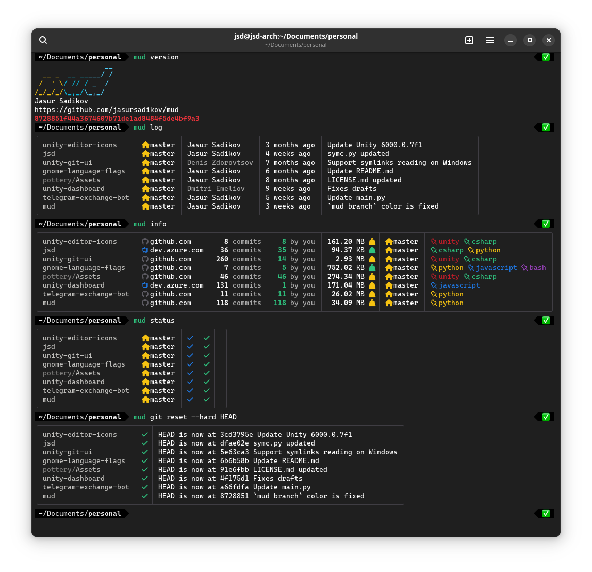

# mud




mud is a multi-directory git runner which allows you to run git commands in a multiple repositories. It has multiple powerful tools filtering tools and support of aliasing.  This tool is not limited to git commands only, you can run any commands as you wish, but this tool was primarily designed to be used with git, so each referenced directory should have `.git`.

## Installing

1. Download [install.sh](install.sh) script.
2. Run `install.sh` to install.

## Getting started

1. Run `mud config` to start interactive wizard which help you to set the preferable settings. Check [settings](#settings) section for more. At the end, `.mudsettings` file will appear at your home directory that you can alter in the future.
2. Locate to your preferable directory with repositories.
3. Run `mud init` command to create `.mudconfig` file. This file is important to keep references to repositories. All repositories in current dictionary would be included to `.mudconfig`.
4. Optional: Run [`mud --set-global`](#global-mudconfig) to make current configuration default and reachable from any directory.

All entries are stored in `.mudconfig` in TSV format. After making your first entry, you can open `.mudconfig` in a text editor and modify it according to your needs.

### Global .mudconfig
- `mud --set-global` - sets current `.mudconfig` as a global configuration, so it would be used as a fallback configuration to run from any directory.

## Using

### Commands
`mud <FILTER> <COMMAND>` will execute bash command across all repositories. To filter repositories check [arguments](#arguments) section.

- `mud info` - displays branch divergence and working directory changes.
- `mud status` - displays working directory changes.
- `mud log` - displays latest commit message, it's time and it's author.
- `mud labels` - displays mud labels across repositories.
- `mud branch` - displays all branches in repositories.
- `mud tags` - displays git tags in repositories.
- `mud update` - check for available updates.

### Arguments
- `-l=<label>` or `--label=<label>` - filters out repositories with provided label.
- `-nl=<label>` or `--not-label=<label>` - filters out repositories excluding provided label. You should include some repos with `--label` first.
- `-b=<branch>` or `--branch=<branch>` - filters out repositories by current branch name.
- `-m` or `--modified` - filters out modified repositories.
- `-d` or `--diverged` - filters repositories with diverged branches.
- `-t` or `--table` - toggles default table view setting for run.
- `-a` or `--async` - toggles asynchronous run feature.
```
Example:
mud -b=master -d git pull
# Filters out all repos with master branch and diverged branches and then runs pull command.
```

## Settings

Settings are stored in your home directory in `.mudsettings` file.

- `config_path = /home/user/path/.mudconfig` - this is set up by `mud --set-global` [command](#global-mudconfig).
- `nerd_fonts = 0/1` - toggles whenever nerd font icons should be used in output.
- `run_async = 0/1` - enabled to run commands asynchronously.
- `run_table = 0/1` - enable to see asynchronous commands in a table view. Requires `run_async`.
- `simplify_branches = 0/1` - simplifies branch name in the branch view.

### Aliases
You can create your own aliases for commands. To create your own aliases, edit .mudsettings file, `[alias]` section. .mudsettings has the following aliases by default:
```ini
[alias]
to = git checkout
fetch = git fetch
pull = git pull
push = git push
```

## Labeling

You can modify your .mudconfig file by using following commands:

### Adding and labeling repositories
- `mud add <label> <path>` - adds path with an optional label.
- `mud add <path>` - adds path without a label.

### Removing labels and repositories
- `mud remove <label>` - removes label from all directories.
- `mud remove <path>` - removes directory with a specified path.
- `mud remove <label> <path>` - removes label from a directory.
